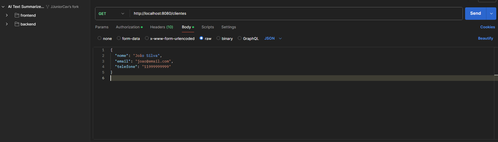
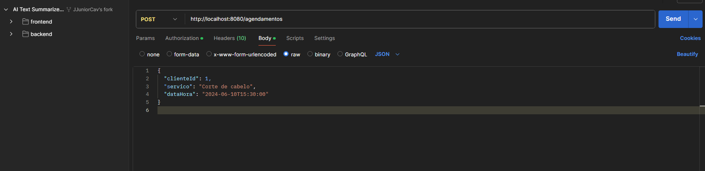

# 🚀 **Barber Shop API (Back-End)**  

## 📌 **Descrição do Projeto**  

Este projeto é uma **API REST para gerenciamento de agendamentos em barbearias**, permitindo que os clientes **agendem horários** e os administradores **gerenciem os serviços oferecidos**.  

✅ **Funcionalidades principais:**  
✔ Cadastro, atualização, listagem e remoção de **clientes**.  
✔ Agendamento e cancelamento de **serviços**.  
✔ Banco de dados **PostgreSQL** utilizando **JPA/Hibernate**.  
✔ Versionamento de banco com **Flyway**.  
✔ API REST seguindo **boas práticas** e **arquitetura MVC**.  

---

## 🔧 **Tecnologias Utilizadas**  

| Tecnologia           | Descrição |
|----------------------|-------------------------------------------|
| **Java 17+**        | Linguagem de programação principal do projeto. |
| **Spring Boot 3**   | Framework para desenvolvimento da API REST. |
| **PostgreSQL**      | Banco de dados relacional para armazenamento das informações. |
| **JPA / Hibernate** | ORM para comunicação com o banco de dados. |
| **Flyway**          | Versionamento e migração do banco de dados. |
| **Gradle**          | Gerenciador de dependências e build. |
| **Docker**          | Containerização do PostgreSQL. |

---

## 📂 **1. Estrutura do Projeto**  

O projeto segue **boas práticas de organização**, separando **controladores, serviços, repositórios e entidades**.  

```
barber-shop-api/
│── src/main/java/com/barbershop/barber_shop_api/
│   ├── controller/      # Camada de controle (APIs REST)
│   │   ├── ClienteController.java
│   │   ├── AgendamentoController.java
│   │
│   ├── model/           # Modelos das entidades
│   │   ├── Cliente.java
│   │   ├── Agendamento.java
│   │
│   ├── repository/      # Repositórios para acesso ao banco de dados
│   │   ├── ClienteRepository.java
│   │   ├── AgendamentoRepository.java
│   │
│   ├── service/         # Camada de serviço (Regras de negócio)
│   │   ├── ClienteService.java
│   │   ├── AgendamentoService.java
│   │
│   ├── config/          # Configurações extras (CORS, Flyway, etc)
│   │   ├── CorsConfig.java
│   │
│   ├── BarberShopApiApplication.java  # Classe principal
│
│── src/main/resources/
│   ├── db/migration/   # Migrations do Flyway
│   │   ├── V1__create_tables.sql
│   ├── application.properties  # Configuração do banco de dados
│
│── build.gradle        # Arquivo de configuração do Gradle
│── settings.gradle     # Configuração de dependências
```

---

## 🏗 **2. Configuração do Banco de Dados**  

O projeto utiliza **PostgreSQL no Docker**. Para rodar o banco, execute:  

```sh
docker run --name postgres_container -e POSTGRES_USER=postgres -e POSTGRES_PASSWORD=admin -p ****** -d postgres
```

Caso o container já exista, basta iniciá-lo:  

```sh
docker start postgres_container
```

### 📌 **2.1. Configuração no `application.properties`**
```properties
spring.datasource.url=jdbc:postgresql://localhost:5432/barbershop
spring.datasource.username=postgres
spring.datasource.password=****
spring.jpa.hibernate.ddl-auto=update
spring.flyway.enabled=true
```

---

## 🚀 **3. Como Rodar o Projeto**  

### 📌 **3.1. Rodar o Banco de Dados (Docker)**
```sh
docker start postgres_container
```

### 📌 **3.2. Rodar a API**
```sh
cd barber-shop-api
./gradlew bootRun
```

A API estará disponível em **http://localhost:8080** 🚀  

---

## 🌍 **4. Endpoints da API (Testar no Postman)**  

A API expõe **endpoints REST** para gerenciar clientes e agendamentos.  

### 📌 **4.1. Clientes**
| Método | Endpoint               | Descrição |
|--------|-------------------------|-----------------------------|
| `GET`  | `/clientes`             | Lista todos os clientes. |
| `POST` | `/clientes`             | Cadastra um novo cliente. |
| `PUT`  | `/clientes/{id}`        | Atualiza um cliente pelo ID. |
| `DELETE` | `/clientes/{id}`      | Remove um cliente pelo ID. |

<p align="center">
  
</p>  

### 📌 **4.2. Agendamentos**
| Método | Endpoint                  | Descrição |
|--------|----------------------------|-----------------------------|
| `GET`  | `/agendamentos`            | Lista todos os agendamentos. |
| `POST` | `/agendamentos`            | Cria um novo agendamento. |
| `DELETE` | `/agendamentos/{id}`      | Cancela um agendamento. |

<p align="center">
  
</p>  

---

## 🔗 **5. Comunicação com o Banco de Dados (JPA/Hibernate)**  

A aplicação utiliza **JPA (Hibernate)** para comunicação com o banco de dados.  

📌 **Exemplo da entidade `Cliente.java`**  
```java
package com.barbershop.barber_shop_api.model;

import jakarta.persistence.*;
import lombok.Data;

@Entity
@Data
public class Cliente {
    @Id
    @GeneratedValue(strategy = GenerationType.IDENTITY)
    private Long id;
    
    private String nome;
    private String email;
    private String telefone;
}
```

📌 **Exemplo do `ClienteRepository.java`**  
```java
package com.barbershop.barber_shop_api.repository;

import com.barbershop.barber_shop_api.model.Cliente;
import org.springframework.data.jpa.repository.JpaRepository;

public interface ClienteRepository extends JpaRepository<Cliente, Long> {
}
```

📌 **Exemplo do `ClienteService.java`**  
```java
package com.barbershop.barber_shop_api.service;

import com.barbershop.barber_shop_api.model.Cliente;
import com.barbershop.barber_shop_api.repository.ClienteRepository;
import org.springframework.stereotype.Service;

import java.util.List;

@Service
public class ClienteService {

    private final ClienteRepository clienteRepository;

    public ClienteService(ClienteRepository clienteRepository) {
        this.clienteRepository = clienteRepository;
    }

    public List<Cliente> listarTodos() {
        return clienteRepository.findAll();
    }

    public Cliente salvar(Cliente cliente) {
        return clienteRepository.save(cliente);
    }

    public void deletar(Long id) {
        clienteRepository.deleteById(id);
    }
}
```

---

## 🎯 **6. Conclusão**  

✅ **API REST completa** para **gestão de clientes e agendamentos**.  
✅ Uso de **Spring Boot + PostgreSQL + Docker**.  
✅ Arquitetura organizada seguindo **boas práticas**.  
✅ Banco de dados versionado com **Flyway**.  

🚀 **Agora a API está pronta para integração com o Front-End!**  

---

📢 **Gostou do projeto?** Deixe seu comentário e compartilhe suas sugestões! 😃🔥  
